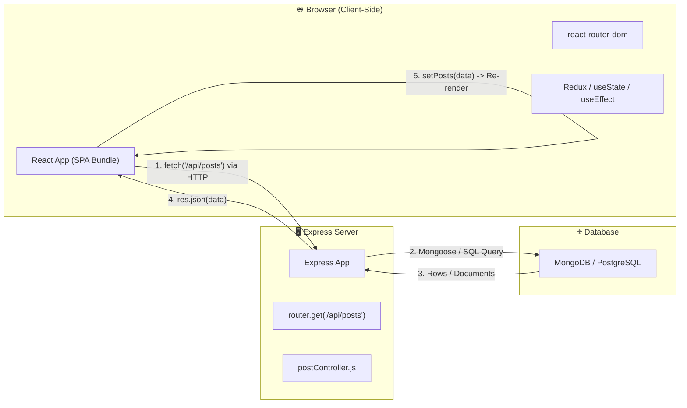
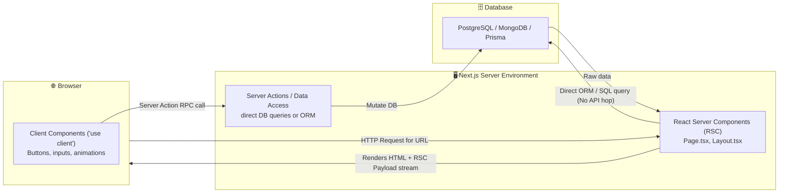

---
tags:
  - nextjs/foundations
  - mern-bridge
  - architecture
created: 2026-08-16
---

# 🌉 MERN to Next.js: The Complete Mental Shift

Welcome! You already know how to build apps with **React (Client SPA) + Node/Express (API) + MongoDB/SQL (Database)**. 

To master Next.js, you don't need to forget MERN — you just need to understand **where the pieces moved**.

---

## 1. 🔍 Architecture Comparison

### The MERN Stack Architecture (Two Separate Worlds)
In standard MERN, your frontend and backend live in two completely separate execution environments:

### The Next.js App Router Architecture (Unified Fullstack)
In Next.js, the boundary between server and client is blurred and unified:

---

## 2. 🔄 Side-by-Side Concept Translation Table

| Feature / Problem | How You Did It in MERN | How You Do It in Next.js App Router |
| :--- | :--- | :--- |
| **Routing** | `react-router-dom` with `<Routes>` and `<Route path="/posts/:id" element={<Post />} />` | **File-System Routing**: Folders create URLs (`app/posts/[id]/page.tsx`). No router setup needed. |
| **Fetching Initial Data** | `useEffect(() => { axios.get('/api/...').then(setData) }, [])` + loading spinners | **Async Server Component**: `export default async function Page() { const data = await db.query(); return 
...
 }` |
| **API Endpoints** | Express routes (`app.get('/api/users', controller)`) | **Route Handlers**: `app/api/users/route.ts` (exporting `GET`, `POST`, etc.) or direct **Server Actions**. |
| **Form Submissions / Mutations** | `onSubmit` $\rightarrow$ `axios.post('/api/users', payload)` $\rightarrow$ update Redux state | **Server Actions**: `async function saveUser(formData) { 'use server'; await db.create(...) }` |
| **Protecting Routes** | `PrivateRoute.jsx` wrapper component with `localStorage.getItem('token')` | **`middleware.ts`** running on the Edge/Server *before* the request even hits the page. |
| **Environment Variables** | `process.env.SECRET` in Node, `REACT_APP_` / `VITE_` in frontend | Automatic isolation: Server variables are private by default; public variables require `NEXT_PUBLIC_` prefix. |

---

## 3. 💡 The Big Revelation: Why Next.js is Not Just React

> [!MERN_COMPARISON]
> In MERN, the browser downloads a blank `index.html`, a giant 2MB JavaScript bundle, evaluates the JS, mounts React, shows a loading spinner, triggers an API request to Express, waits 200ms, receives JSON, and finally renders the UI.
>
> In Next.js:
> 1. The request arrives at the Next.js server.
> 2. The server runs your component, connects directly to your database, and renders HTML.
> 3. The browser receives instant, meaningful HTML. Zero layout shifts, zero loading cascades for initial page loads.

---

## 4. 🧠 Key Mental Shift Checklist

- [x] **Rule 1**: By default, **every component in `app/` is a Server Component**. It runs on the server, not the browser.
- [x] **Rule 2**: Server Components can be `async` and can talk to databases, file systems, or private APIs directly.
- [x] **Rule 3**: You only add `'use client'` at the top of a file when you need browser APIs (`onClick`, `onChange`, `useState`, `useEffect`, `localStorage`).
- [x] **Rule 4**: You don't need Express just to get data into a page. Your page *is* the server renderer.

---

## 🔗 Related Notes
- `[[01-Foundations/02-rsc-vs-client-components|Next: React Server Components vs Client Components]]`
- `[[02-TypeScript-In-Action/01-ts-for-mern-devs|TypeScript Essentials for MERN Devs]]`
- `[[00-Index|Return to Index]]`
