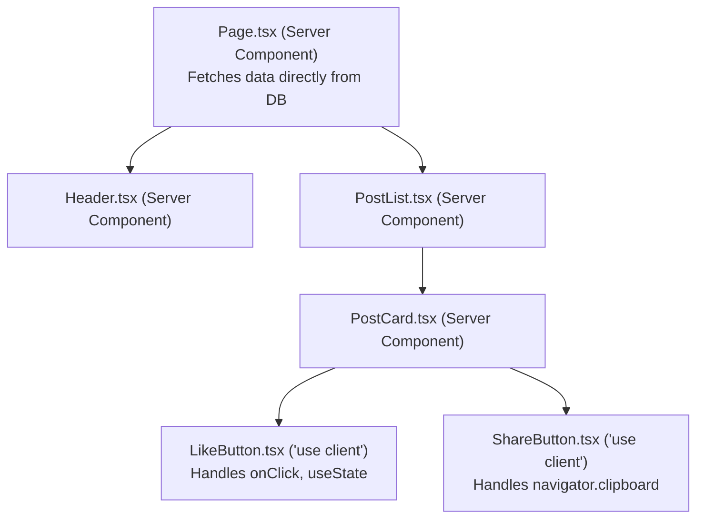

---
tags:
  - nextjs/rsc
  - nextjs/client-components
  - react19
  - architecture
created: 2026-08-16
---

# ⚡ Server Components (RSC) vs Client Components

The most fundamental concept in modern Next.js is the **Server / Client Boundary**.

---

## 1. 🎯 The Golden Rule

> [!IMPORTANT]
> **Server by Default:** Every component inside the `app/` directory is a **Server Component** unless you explicitly add `'use client'` at the very top of the file.

---

## 2. ⚖️ Comparison: What Can Run Where?

| Capability | Server Component (Default) | Client Component (`'use client'`) |
| :--- | :---: | :---: |
| Direct Database Query (Prisma, Mongoose, SQL) | ✅ **YES** | ❌ **NO** (Exposes credentials!) |
| Access Private Secrets / Env (`process.env.DB_PASSWORD`) | ✅ **YES** | ❌ **NO** (Security hazard) |
| Async Component (`async function Page()`) | ✅ **YES** | ❌ **NO** (React client components cannot be async) |
| React State (`useState`, `useReducer`) | ❌ **NO** | ✅ **YES** |
| React Effects (`useEffect`, `useLayoutEffect`) | ❌ **NO** | ✅ **YES** |
| Browser Event Listeners (`onClick`, `onChange`, `onSubmit`) | ❌ **NO** | ✅ **YES** |
| Browser APIs (`window`, `document`, `localStorage`) | ❌ **NO** | ✅ **YES** |
| Zero JavaScript sent to Browser Bundle | ✅ **YES** (Reduces bundle size) | ❌ **NO** (Hydrated in browser) |

---

## 3. 🧩 Component Composition Pattern: Leaf Pattern

How do you mix Server Components and Client Components in real applications?

You keep the **root of your subtree on the server**, and push `'use client'` down to the smallest interactive **"leaves"** of your component tree.



### 💻 Code Example: The Leaf Pattern

#### `app/posts/page.tsx` (Server Component)
```tsx
import { LikeButton } from "./LikeButton";

// Direct database query on server:
async function getPosts() {
  // In real app: const posts = await prisma.post.findMany();
  return [
    { id: "1", title: "Mastering Next.js", likes: 42 },
    { id: "2", title: "TypeScript for MERN Devs", likes: 99 },
  ];
}

export default async function PostsPage() {
  const posts = await getPosts();

  return (
    <main className="p-8 space-y-4">
      <h1 className="text-2xl font-bold">Latest Posts</h1>
      <div className="grid gap-4">
        {posts.map((post) => (
          <article key={post.id} className="p-4 border rounded shadow-sm">
            <h2 className="text-lg font-semibold">{post.title}</h2>
            
            {/* Interactive Client Component embedded inside Server Component */}
            <LikeButton initialLikes={post.likes} postId={post.id} />
          </article>
        ))}
      </div>
    </main>
  );
}
```

#### `app/posts/LikeButton.tsx` (Client Component)
```tsx
"use client";

import { useState } from "react";

interface LikeButtonProps {
  initialLikes: number;
  postId: string;
}

export function LikeButton({ initialLikes, postId }: LikeButtonProps) {
  const [likes, setLikes] = useState<number>(initialLikes);
  const [isLiked, setIsLiked] = useState<boolean>(false);

  const handleLike = () => {
    setIsLiked(!isLiked);
    setLikes((prev) => (isLiked ? prev - 1 : prev + 1));
  };

  return (
    <button
      onClick={handleLike}
      className={`px-3 py-1 mt-2 text-sm rounded ${
        isLiked ? "bg-red-500 text-white" : "bg-zinc-200 text-zinc-800"
      }`}
    >
      ❤️ {likes} Likes
    </button>
  );
}
```

---

## 4. ⚠️ Common Traps & Misconceptions

> [!WARNING]
> **Trap 1: Putting `'use client'` on every page.**
> If you put `'use client'` at the top of your `page.tsx`, you forfeit all Server Component benefits: zero-bundle weight, direct database access, and SEO prerendering. Keep pages as Server Components!

> [!WARNING]
> **Trap 2: Passing non-serializable props from Server to Client.**
> When passing props from a Server Component to a Client Component, data must be serializable to JSON (strings, numbers, arrays, plain objects, booleans). You **cannot** pass functions, class instances, or database connection handles across the boundary.

---

## 🔗 Related Notes
- `[[01-Foundations/01-mern-vs-nextjs-mental-model|MERN vs Next.js Mental Model]]`
- `[[02-TypeScript-In-Action/01-ts-for-mern-devs|TypeScript Essentials for MERN Devs]]`
- `[[04-Data-Fetching-Caching/01-server-fetching-and-suspense|Server Fetching & Suspense]]`
