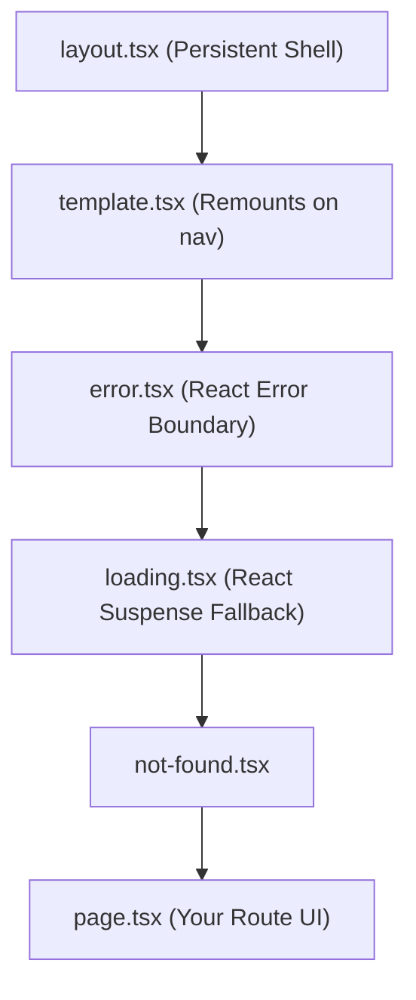

---
tags:
  - nextjs/routing
  - nextjs/layouts
  - app-router
created: 2026-08-16
---

# 🚦 Next.js App Router: File Conventions & Routing

In MERN, you configured routes inside `App.jsx` with `<Routes>` and `<Route path="/dashboard" element={<Dashboard />} />`. 

Next.js replaces this entire manual setup with **File-System Routing**.

---

## 1. 📂 Special File Conventions

Inside any folder in `app/`, Next.js recognizes special reserved file names:

| File Name | Purpose | Execution |
| :--- | :--- | :--- |
| `page.tsx` | Makes the route publicly accessible. Defines UI for that URL segment. | Server Component (default) |
| `layout.tsx` | Wraps all child pages. **Preserves state on navigation** (does not remount). | Server Component (default) |
| `template.tsx` | Similar to layout, but **creates a fresh instance on every navigation** (useful for enter animations). | Server Component (default) |
| `loading.tsx` | Instant loading UI powered by React `<Suspense>`. | Client/Server UI |
| `error.tsx` | Catches runtime errors in child subtree using React Error Boundary. | **MUST BE `'use client'`** |
| `not-found.tsx` | Rendered when `notFound()` is thrown from a page or invalid route. | Server Component |
| `route.ts` | Backend API endpoint (Equivalent to Express route handler). | Server Only |

---

## 2. 🌳 Visual Component Tree Hierarchy

Next.js automatically nests these special files in a specific order:



---

## 3. 🎯 Route Folder Types

### A. Static Routes
- `app/about/page.tsx` $\rightarrow$ `/about`
- `app/pricing/page.tsx` $\rightarrow$ `/pricing`

### B. Dynamic Segments (URL Parameters)
- `app/posts/[id]/page.tsx` $\rightarrow$ `/posts/123` or `/posts/abc`
- Access via `const { id } = await params;`

### C. Catch-All & Optional Catch-All
- `app/docs/[...slug]/page.tsx` $\rightarrow$ `/docs/intro`, `/docs/setup/install` (`slug` is `string[]`)
- `app/docs/[[...slug]]/page.tsx` $\rightarrow$ Also matches `/docs` alone!

### D. Route Groups (Organizing Without Changing URLs)
- Folders with parentheses `(marketing)` or `(dashboard)` are ignored in the URL path.
- `app/(marketing)/about/page.tsx` $\rightarrow$ URL is `/about` (NOT `/marketing/about`)
- Allows multiple root layouts for different sections of the app (e.g. Auth layout vs App layout).

---

## 4. 🔗 Navigation: `<Link>` vs `useRouter()`

### Declarative Navigation (Preferred):
```tsx
import Link from "next/link";

// Next.js automatically prefetches links in the viewport for instant clicks!
<Link href="/posts/42" className="text-blue-500 hover:underline">
  View Post
</Link>
```

### Programmatic Navigation (Client Only):
```tsx
"use client";

import { useRouter } from "next/navigation"; // Note: next/navigation, NOT next/router!

export function LogoutButton() {
  const router = useRouter();

  const handleLogout = async () => {
    // perform logout action...
    router.push("/login");
    router.refresh(); // Re-fetches server data
  };

  return <button onClick={handleLogout}>Log Out</button>;
}
```

---

## 🔗 Related Notes
- `[[01-Foundations/01-mern-vs-nextjs-mental-model|MERN vs Next.js Mental Model]]`
- `[[04-Data-Fetching-Caching/01-server-fetching-and-suspense|Server Fetching & Suspense]]`
- `[[05-Mutations-Server-Actions/01-server-actions-vs-express|Server Actions vs Express]]`
