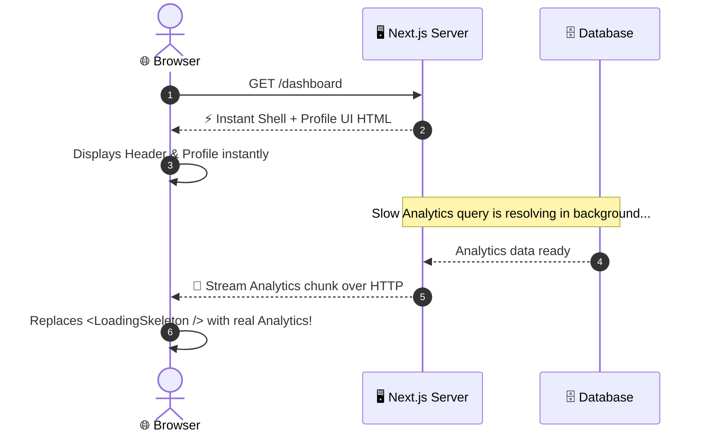

---
tags:
  - nextjs/data-fetching
  - nextjs/suspense
  - streaming
  - caching
created: 2026-08-16
---

# ⚡ Data Fetching & Streaming in Next.js

In React SPA / MERN, fetching data required a boilerplate ritual:

```jsx
// ❌ Old MERN Client SPA Pattern:
const [data, setData] = useState(null);
const [loading, setLoading] = useState(true);
const [error, setError] = useState(null);

useEffect(() => {
  axios.get('/api/posts')
    .then(res => setData(res.data))
    .catch(err => setError(err))
    .finally(() => setLoading(false));
}, []);
```

In Next.js App Router, **all of this boilerplate is gone**.

---

## 1. 🚀 Direct Async Server Components

Because Server Components run on the server, you simply make your component `async` and `await` your database query or fetch directly:

```tsx
// ✅ Next.js Server Component:
interface Post {
  id: string;
  title: string;
  author: string;
}

// Fetch helper (or direct Prisma/Mongoose query)
async function getPosts(): Promise<Post[]> {
  const res = await fetch("https://api.example.com/posts");
  if (!res.ok) throw new Error("Failed to fetch posts");
  return res.json();
}

export default async function PostsPage() {
  const posts = await getPosts();

  return (
    <div className="p-6">
      <h1 className="text-2xl font-bold">Posts Feed</h1>
      <ul>
        {posts.map((post) => (
          <li key={post.id}>{post.title} by {post.author}</li>
        ))}
      </ul>
    </div>
  );
}
```

---

## 2. 🌊 Suspense & Streaming (Instant TTFB)

What if you have one fast section on a page (e.g. User Profile) and one slow section (e.g. Complex Analytics)?

In standard MERN, the entire page would wait for the slowest query or show spinners.
In Next.js, with **React Suspense**, you stream the fast parts instantly, while the slow parts stream in as they finish:



### 💻 Code Implementation with Suspense:

```tsx
import { Suspense } from "react";
import { UserProfile } from "@/components/UserProfile";
import { SlowAnalytics, AnalyticsSkeleton } from "@/components/SlowAnalytics";

export default function DashboardPage() {
  return (
    <main className="p-8 space-y-6">
      <h1 className="text-3xl font-bold">Dashboard</h1>
      
      {/* 1. Fast section renders immediately */}
      <UserProfile />

      {/* 2. Slow section streams in when ready */}
      <Suspense fallback={<AnalyticsSkeleton />}>
        <SlowAnalytics />
      </Suspense>
    </main>
  );
}
```

---

## 3. 🚦 Preventing Waterfalls: Parallel Data Fetching

When fetching multiple independent resources, avoid sequential awaits:

```tsx
// ❌ SLOW: Sequential Waterfall (Takes 200ms + 300ms = 500ms)
const user = await getUser(userId);
const posts = await getUserPosts(userId);

// ✅ FAST: Parallel Fetching (Takes max(200ms, 300ms) = 300ms)
const [user, posts] = await Promise.all([
  getUser(userId),
  getUserPosts(userId),
]);
```

---

## 🔗 Related Notes
- `[[01-Foundations/02-rsc-vs-client-components|Server vs Client Components]]`
- `[[03-Routing-Layouts/01-app-router-mental-model|App Router Mental Model]]`
- `[[05-Mutations-Server-Actions/01-server-actions-vs-express|Server Actions vs Express]]`
