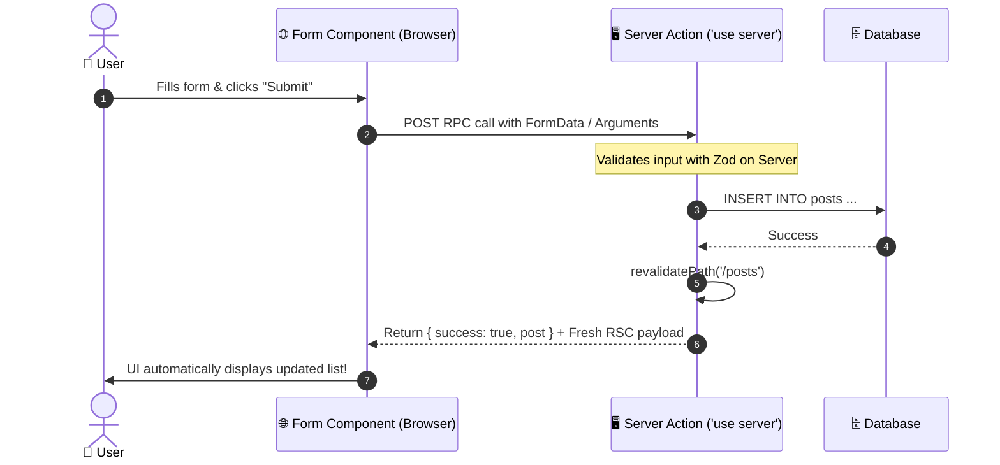

---
tags:
  - nextjs/server-actions
  - nextjs/mutations
  - react19
  - mern-bridge
created: 2026-08-16
---

# 🔄 Server Actions vs Express Controllers

In traditional MERN, whenever a user submitted a form or clicked a button that mutated data:

1. You wrote an Express controller: `postController.createPost(req, res)`
2. You mapped an Express route: `router.post('/api/posts', authMiddleware, createPost)`
3. You set up client state: `const [formData, setFormData] = useState(...)`
4. You wrote an Axios call: `await axios.post('/api/posts', formData)`
5. You manually synced local state: `setPosts([res.data, ...posts])`

Next.js introduces **Server Actions** to collapse this entire 5-step pipeline into a single, type-safe asynchronous function.

---

## 1. ⚙️ How Server Actions Work

A Server Action is an `async` function marked with the `'use server'` directive.

Under the hood, Next.js automatically creates an encrypted POST endpoint, serializes the arguments, executes the code purely on the server, and triggers automatic UI cache revalidation.



---

## 2. 💻 Complete Type-Safe Server Action Example

### A. The Server Action (`actions/posts.ts`)
```ts
"use server";

import { revalidatePath } from "next/cache";
import { z } from "zod";

// 1. Zod Validation Schema:
const PostSchema = z.object({
  title: z.string().min(3, "Title must be at least 3 chars"),
  content: z.string().min(10, "Content must be at least 10 chars"),
});

// 2. Return Type Definition:
export interface FormState {
  success: boolean;
  message?: string;
  errors?: {
    title?: string[];
    content?: string[];
  };
}

// 3. The Server Action Function:
export async function createPostAction(
  prevState: FormState,
  formData: FormData
): Promise<FormState> {
  const rawData = {
    title: formData.get("title"),
    content: formData.get("content"),
  };

  // Safe validation:
  const validated = PostSchema.safeParse(rawData);

  if (!validated.success) {
    return {
      success: false,
      errors: validated.error.flatten().fieldErrors,
    };
  }

  // Database mutation (e.g. Prisma / Mongo):
  // await db.post.create({ data: validated.data });

  // Tell Next.js to purge cached HTML and re-render the posts page:
  revalidatePath("/posts");

  return {
    success: true,
    message: "Post published successfully!",
  };
}
```

### B. The Form Component with React 19 `useActionState` (`components/CreatePostForm.tsx`)
```tsx
"use client";

import { useActionState } from "react";
import { createPostAction, FormState } from "@/actions/posts";

const initialState: FormState = {
  success: false,
};

export function CreatePostForm() {
  const [state, formAction, isPending] = useActionState(createPostAction, initialState);

  return (
    <form action={formAction} className="max-w-md space-y-4 p-6 border rounded">
      <div>
        <label className="block text-sm font-medium">Title</label>
        <input
          name="title"
          className="w-full border p-2 rounded"
          disabled={isPending}
        />
        {state.errors?.title && (
          <p className="text-red-500 text-xs mt-1">{state.errors.title[0]}</p>
        )}
      </div>

      <div>
        <label className="block text-sm font-medium">Content</label>
        <textarea
          name="content"
          className="w-full border p-2 rounded"
          rows={4}
          disabled={isPending}
        />
        {state.errors?.content && (
          <p className="text-red-500 text-xs mt-1">{state.errors.content[0]}</p>
        )}
      </div>

      <button
        type="submit"
        disabled={isPending}
        className="px-4 py-2 bg-blue-600 text-white rounded hover:bg-blue-700 disabled:opacity-50"
      >
        {isPending ? "Publishing..." : "Publish Post"}
      </button>

      {state.success && (
        <p className="text-green-600 text-sm">{state.message}</p>
      )}
    </form>
  );
}
```

---

## 3. 🎯 Why This Beats Express + Axios
1. **Zero Endpoint Maintenance**: No need to invent `/api/v1/posts/create` boilerplate routes.
2. **Type Safety Across Boundaries**: Types are shared seamlessly between your form and server handler.
3. **Automatic Cache Invalidation**: Calling `revalidatePath('/posts')` automatically tells Next.js to re-render the Server Components with the fresh database state.

---

## 🔗 Related Notes
- `[[01-Foundations/01-mern-vs-nextjs-mental-model|MERN vs Next.js Mental Model]]`
- `[[02-TypeScript-In-Action/02-typing-react-and-nextjs|Typing Next.js & React 19]]`
- `[[04-Data-Fetching-Caching/01-server-fetching-and-suspense|Server Fetching & Suspense]]`
