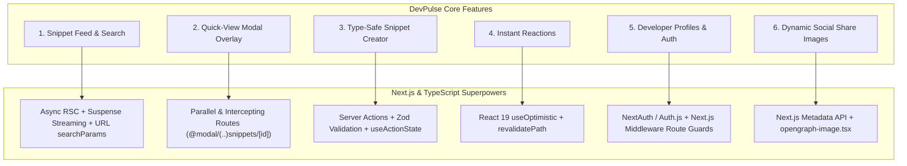

---
tags:
  - project/blueprint
  - devpulse
  - roadmap
created: 2026-08-16
---

# 🚀 Project Blueprint: "DevPulse"

To master Next.js and TypeScript together, we will build **DevPulse** — a modern, production-grade Developer Platform & Snippet Engine.

---

## 🎯 Why This Project Teaches You the Most

Every feature in DevPulse directly maps to a critical Next.js & TypeScript concept:



---

## 🏗️ Technical Architecture & Data Model

### TypeScript Data Entities (`types/index.ts`)
```ts
export type Language = "typescript" | "javascript" | "python" | "rust" | "go" | "sql" | "css";

export interface User {
  id: string;
  name: string;
  username: string;
  avatarUrl: string;
  bio?: string;
  createdAt: Date;
}

export interface Snippet {
  id: string;
  title: string;
  description: string;
  code: string;
  language: Language;
  tags: string[];
  authorId: string;
  author: User;
  likesCount: number;
  isLiked?: boolean;
  createdAt: Date;
  updatedAt: Date;
}
```

---

## 📋 Step-by-Step Milestone Plan

### 📍 Milestone 1: Project Setup & Clean Foundation
- Initialize clean App Router structure with TypeScript.
- Configure Tailwind CSS + dark mode theme tokens.
- Set up root layout, navigation bar, and foundational UI components.

### 📍 Milestone 2: Server Component Feed & Dynamic Routing
- Build the Snippet Feed using **Async Server Components**.
- Add Dynamic Route `/snippets/[id]` with TypeScript page props.
- Add `<Suspense>` loading skeletons for instant streaming.

### 📍 Milestone 3: Search, Filtering & URL State
- Build a search and filter bar using URL `searchParams` (`/snippets?lang=typescript&q=cache`).
- Type search params cleanly in Server Components without client state overhead.

### 📍 Milestone 4: Server Actions & Zod Form Mutations
- Build `/create` snippet form.
- Validate input with **Zod** on the server.
- Hook into React 19's `useActionState` and handle errors cleanly.

### 📍 Milestone 5: Intercepting Routes & Modal Quick-View
- Implement Next.js **Intercepting Routes** (`(..)snippets/[id]`) so clicking a card opens an in-page modal without a full page reload, while maintaining a shareable direct URL.

### 📍 Milestone 6: Optimistic UI Updates
- Implement instant like / reaction toggles using React 19's `useOptimistic`.

### 📍 Milestone 7: Auth, Middleware & Type-Safe Database
- Set up authentication & role-based route protection via `middleware.ts`.
- Connect Prisma / SQLite / PostgreSQL for persistent database storage.

### 📍 Milestone 8: SEO & OpenGraph Image Generation
- Implement dynamic OpenGraph preview cards (`opengraph-image.tsx`) for snippets.
- Add SEO metadata tags.

---

## 🔗 Related Notes
- `[[00-Index|Master Vault Index]]`
- `[[01-Foundations/01-mern-vs-nextjs-mental-model|MERN vs Next.js Mental Model]]`
- `[[02-TypeScript-In-Action/01-ts-for-mern-devs|TypeScript Essentials for MERN Devs]]`
